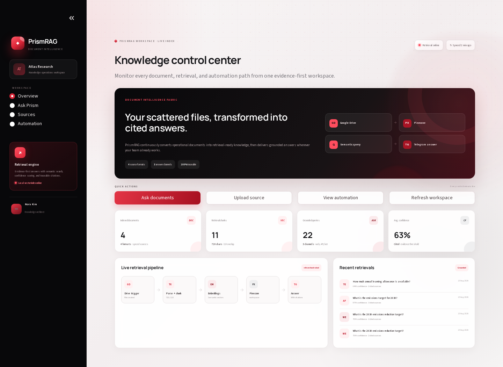
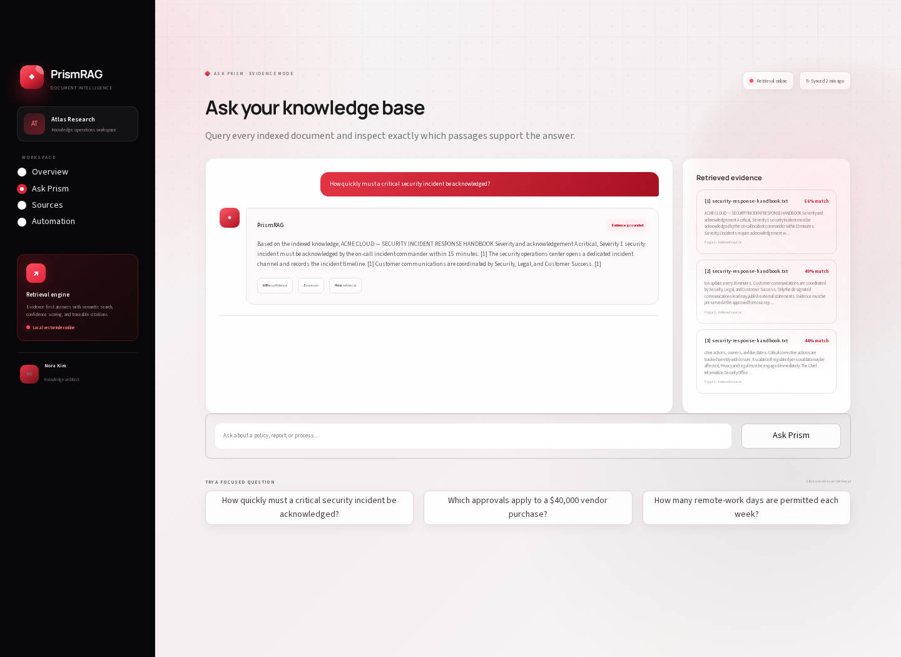
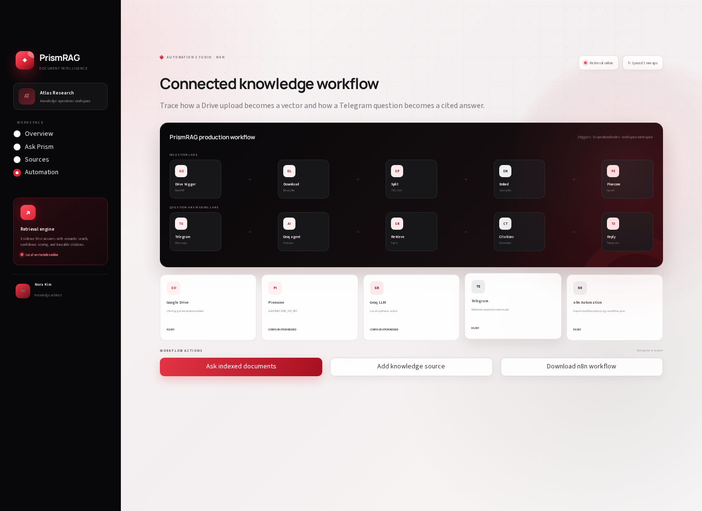
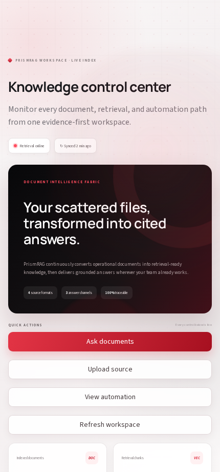

# PrismRAG — Document Intelligence & Automation

PrismRAG is a retrieval-augmented document intelligence platform that turns files into searchable, cited knowledge. It includes a runnable local RAG engine, optional Pinecone integrated embeddings, Google Drive ingestion through n8n, Groq-based answer synthesis, and document-grounded Telegram responses.



## What it delivers

- PDF, DOCX, TXT, and Markdown parsing with validation and deduplication
- Recursive chunking with overlap and deterministic local embeddings
- Semantic retrieval with lexical reranking, confidence scores, and page-level citations
- Local SQLite vector index for a credential-free demo
- Optional Pinecone integrated-embedding mirror for production retrieval
- Optional Groq answer synthesis constrained to retrieved context
- FastAPI endpoints for ingestion, querying, history, status, and automation webhooks
- Importable n8n workflow for Google Drive ingestion and Telegram document QA
- Responsive Streamlit control center with source management and workflow observability
- Docker Compose configuration and automated tests

## Interface gallery

| Ask the knowledge base | Automation workflow |
| --- | --- |
|  |  |

### Mobile knowledge workspace



## Architecture

```text
Google Drive ── n8n trigger ── parser ── recursive chunker
                                         │
                                         ▼
                               embeddings + Pinecone
                                         │
Web / API / Telegram question ── retrieval + reranking
                                         │
                                         ▼
                              grounded LLM synthesis
                                         │
                                         ▼
                          answer + confidence + citations
```

The local mode uses a deterministic hash-based embedding model and SQLite vector store, so the complete ingestion and retrieval flow works without external credentials. Adding Pinecone and Groq credentials activates the production adapters without changing the API or UI workflow.

## Local setup

Python 3.10 or newer is required. In this workspace, use the available Python 3.11 runtime explicitly:

```bash
cd semantic_knowledge_orchestrator
/auto/sw/packages/python3/3.11.11/bin/python3.11 -m venv .venv
.venv/bin/python -m pip install -r requirements.txt
```

Run the dashboard:

```bash
.venv/bin/python -m streamlit run streamlit_app.py
```

Run the API in another terminal:

```bash
.venv/bin/python -m uvicorn app.api:app --host 0.0.0.0 --port 8000 --reload
```

Open `http://localhost:8501` for the product and `http://localhost:8000/docs` for interactive API documentation.

## Demo pipeline

```bash
.venv/bin/python scripts/demo_pipeline.py
```

This seeds four portfolio documents, runs a grounded procurement query, prints retrieved sources, and writes `outputs/demo-answer.txt`.

## n8n automation

Import [`workflows/prismrag-workflow.json`](workflows/prismrag-workflow.json) into n8n. The workflow contains two complete branches:

1. Google Drive file trigger → PDF download → recursive text splitter → embeddings → Pinecone upsert.
2. Telegram message trigger → Groq agent → Pinecone retrieval tool → grounded Telegram response.

After import, attach your Google Drive, Gemini embeddings, Pinecone, Groq, and Telegram credentials, then select the Drive folder and Pinecone index.

## Optional cloud configuration

```bash
cp .env.example .env
.venv/bin/python -m pip install -r requirements-cloud.txt
```

Set `USE_PINECONE=true` and provide `PINECONE_API_KEY`. Add `GROQ_API_KEY` for LLM synthesis and `TELEGRAM_BOT_TOKEN` when sending messages outside n8n. Secrets are never committed.

## API examples

```bash
curl http://localhost:8000/api/v1/health

curl -X POST http://localhost:8000/api/v1/query \
  -H "Content-Type: application/json" \
  -d '{"question":"What is the 2030 emissions target?","channel":"api"}'

curl -X POST http://localhost:8000/api/v1/documents/ingest \
  -F "document=@sample_data/security-response-handbook.txt"
```

## Tests

```bash
.venv/bin/python -m pip install -r requirements-dev.txt
.venv/bin/python -m pytest --cov=app --cov-report=term-missing
```

## Responsible use

- Answers are grounded only when retrieved sources meet the relevance threshold.
- Citations expose the exact document, page, excerpt, and retrieval score.
- External LLM calls occur only when a Groq key is configured.
- Access controls should be enforced at both Google Drive and Pinecone namespace level in production.
- Retrieved answers support human work and should be verified for high-impact decisions.

## Project structure

```text
semantic_knowledge_orchestrator/
├── app/
│   ├── api.py
│   ├── models.py
│   └── services/
│       ├── chunker.py
│       ├── embeddings.py
│       ├── integrations.py
│       ├── parser.py
│       ├── pinecone_store.py
│       ├── rag.py
│       └── store.py
├── docs/screenshots/
├── sample_data/
├── scripts/
├── tests/
├── workflows/prismrag-workflow.json
└── streamlit_app.py
```
